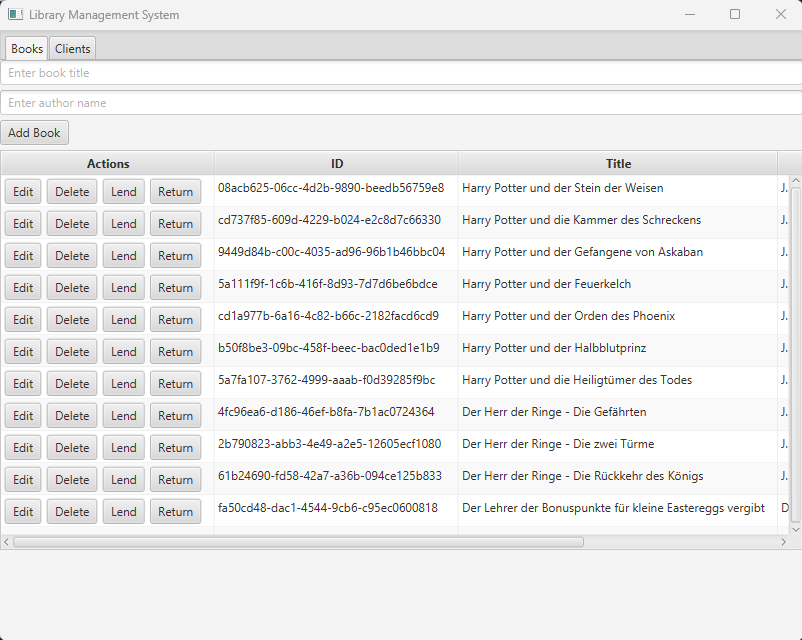
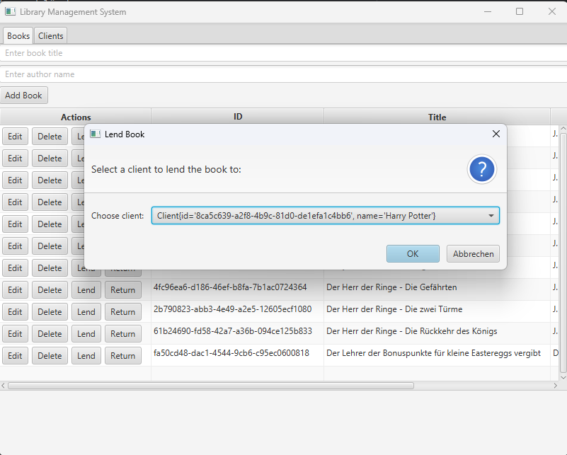

# 📚 Library Management System – OOP2 Abschlussprojekt

## 1. Überblick
Das **Library Management System** ist eine JavaFX-Anwendung, die eine einfache Bibliotheksverwaltung ermöglicht.  
Benutzer können **Bücher und Kunden verwalten**, Bücher ausleihen und zurückgeben.  
Alle Daten werden **lokal in JSON-Dateien gespeichert**, sodass sie auch nach einem Neustart erhalten bleiben.

## 2. Funktionen
- 📖 **Bücherverwaltung:** Bücher hinzufügen, bearbeiten und löschen
- 👤 **Kundenverwaltung:** Kunden hinzufügen und bearbeiten
- 🔄 **Bücher ausleihen & zurückgeben**
- 💾 **Daten bleiben erhalten (JSON-Speicherung)**
- 🎨 **Einfache JavaFX-Benutzeroberfläche**

---

## 3. Screenshots
### **📌 Hauptansicht (Bücherverwaltung)**


### **📌 Bücher ausleihen**


---

## 4. Technische Umsetzung
### **🛠 Verwendete Technologien**
- **JavaFX** für die Benutzeroberfläche
- **Gson** zur JSON-Speicherung der Daten
- **JUnit** für Unit-Tests
- **SLF4J / Logback** für Logging
- **Maven** zur Verwaltung der Abhängigkeiten

### **📂 Projektstruktur**
```txt
LibraryApp/
│── src/main/java/ch/Bibliothek/
│   ├── model/         # Enthält die Datenmodelle (Book, Client)
│   ├── service/       # Enthält die Service-Klassen zur Verwaltung der Daten
│   ├── LibraryApp.java  # Hauptklasse mit der GUI
│── src/test/java/      # Unit-Tests
│── resources/          # JSON-Dateien für gespeicherte Daten
│── README.md           # Diese Dokumentation
│── requirements.md     # Projektanforderungen
│── pom.xml             # Maven-Projektdatei
```

## 5. Installation & Nutzung

### 🔧 Voraussetzungen
- Java 17+
- Maven installiert

### 🚀 Starten der Anwendung

#### 1️⃣ Klonen des Repositories:
```sh
git clone https://github.com/dein-repo/library-app.git
```

#### 2️⃣ Mit Maven bauen:
mvn package

#### 3️⃣ Starten der Anwendung:
java -jar target/libraryapp.jar

